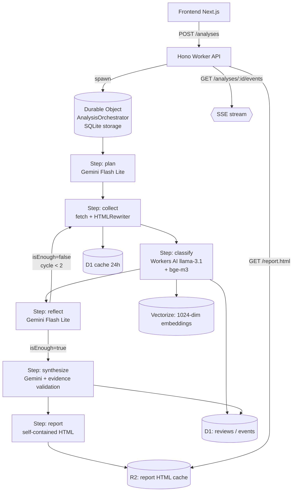

# VoC Intelligence Agent

Agentowy system AI, który zbiera publiczne opinie klientów (Trustpilot, Opineo, App Store
oraz import CSV/JSON) o wybranej firmie i jej konkurentach, klasyfikuje sentyment i
tematykę, klasteruje tematy w przestrzeni embeddingów, a następnie syntetyzuje raport
biznesowy z wykresami i listą priorytetowych action itemów. Cały projekt mieści się
**wyłącznie w darmowych tierach** (Cloudflare Workers + D1 + Vectorize + Workers AI + R2 +
Pages, Gemini 2.5 Flash Lite, Brave Search) — bez płatnych usług.

- **Durable Object jako custom workflow engine**. Cloudflare Workflows są płatne; zbudowałem
  zamiennik na DO z SQLite storage + alarm-driven step loop. Każdy krok = osobna invocation,
  więc nie wpada w 30s CPU limit per request.
- **Mixed-model inference**. Workers AI (`llama-3.1-8b-instruct` + `bge-m3`) do klasyfikacji
  sentymentu i embeddingów, Gemini 2.5 Flash Lite do planowania, refleksji i syntezy.
  Per-day neuron counter z fallbackiem na Gemini gdy zostało <500 neuronów.
- **Pętla agentic z refleksją**: `plan → collect → classify → reflect → [collect ↻] → synthesize`.
  Po pierwszej rundzie Gemini decyduje, czy potrzeba dociągnąć dane (max 2 cykle).
  Reasoning agenta jest pokazywany użytkownikowi w UI ("Agent thinks aloud").
- **Evidence-grounded action items**. Każdy cytat z raportu jest walidowany substring
  matchem przeciwko bazie recenzji w D1. Halucynacje → retry syntezy z notatką
  "popraw cytat X".
- **Vectorize semantic clustering** — embeddingi `bge-m3` (1024-dim, multilingual) per
  recenzja, upsert z metadata (`analysisId`, `sentiment`, `category`, `rating`).
- **Graceful degradation**. Quota guard zwraca 503 gdy Workers AI > 80% dziennego limitu.
  Frontend automatycznie przechodzi w tryb demo gdy API niedostępne. Trustpilot blokuje
  scraping → fail-fast guard z user-actionable message zamiast generowania pustego raportu.

## Architektura

