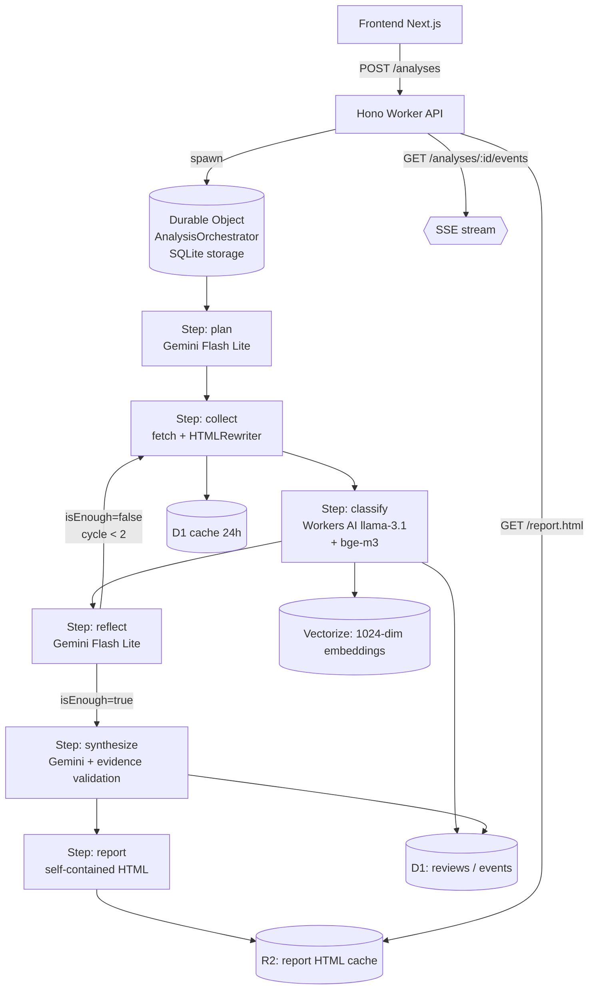

# VoC Intelligence Agent

> **Live demo**: _wstaw URL z Cloudflare Pages tutaj_ · **API**: _wstaw URL Workers tutaj_
>
> 

Agentowy system AI, który zbiera publiczne opinie klientów (Trustpilot, Opineo, App Store
oraz import CSV/JSON) o wybranej firmie i jej konkurentach, klasyfikuje sentyment i
tematykę, klasteruje tematy w przestrzeni embeddingów, a następnie syntetyzuje raport
biznesowy z wykresami i listą priorytetowych action itemów. Cały projekt mieści się
**wyłącznie w darmowych tierach** (Cloudflare Workers + D1 + Vectorize + Workers AI + R2 +
Pages, Gemini 2.5 Flash Lite, Brave Search) — bez płatnych usług.

## Co tu jest ciekawego dla rekrutera

- **Durable Object jako custom workflow engine**. Cloudflare Workflows są płatne; zbudowałem
  zamiennik na DO z SQLite storage + alarm-driven step loop. Każdy krok = osobna invocation,
  więc nie wpada w 30s CPU limit per request.
- **Mixed-model inference**. Workers AI (`llama-3.1-8b-instruct` + `bge-m3`) do klasyfikacji
  sentymentu i embeddingów, Gemini 2.5 Flash Lite do planowania, refleksji i syntezy.
  Per-day neuron counter z fallbackiem na Gemini gdy zostało <500 neuronów.
- **Pętla agentic z refleksją**: `plan → collect → classify → reflect → [collect ↻] → synthesize`.
  Po pierwszej rundzie Gemini decyduje, czy potrzeba dociągnąć dane (max 2 cykle).
  Reasoning agenta jest pokazywany użytkownikowi w UI ("Agent thinks aloud").
- **Evidence-grounded action items**. Każdy cytat z raportu jest walidowany substring
  matchem przeciwko bazie recenzji w D1. Halucynacje → retry syntezy z notatką
  "popraw cytat X".
- **Vectorize semantic clustering** — embeddingi `bge-m3` (1024-dim, multilingual) per
  recenzja, upsert z metadata (`analysisId`, `sentiment`, `category`, `rating`).
- **Graceful degradation**. Quota guard zwraca 503 gdy Workers AI > 80% dziennego limitu.
  Frontend automatycznie przechodzi w tryb demo gdy API niedostępne. Trustpilot blokuje
  scraping → fail-fast guard z user-actionable message zamiast generowania pustego raportu.

## Architektura



## Free tier limits & graceful degradation

| Usługa            | Limit                              | Co robimy gdy się skończy                              |
| ----------------- | ---------------------------------- | ------------------------------------------------------ |
| Workers AI        | 10 000 neuronów / dzień            | Po 80% — 503 + sugestia `manual_paste`. Po 95% — fallback Gemini |
| Gemini Flash Lite | 1 500 RPD                          | 429 → 60s sleep + retry; 2× → status `rate_limited`    |
| Brave Search      | 2 000 zapytań / mc                 | Search opcjonalny, scrape działa też z URL guess       |
| D1                | 5M reads / dzień                   | Cache scrapingu 24h, agregaty obliczane na żądanie     |
| Vectorize         | 30M dimensions queried / mc        | Embedding tylko nowych recenzji per analiza            |
| Workers Requests  | 100k / dzień                       | SSE polling co 500ms (zamiast WebSocket)               |

**Kluczowy detal**: Trustpilot ma własny bot-protection na Workers IP (HTTP 403). Auto mode
jest dokumentowane jako "best effort"; `manual_paste` to gwarantowana ścieżka demo (CSV /
JSON / plaintext z autodetektem formatu).

## API endpoints

Wszystkie poza `/health` i `/demo/*` wymagają nagłówka `x-api-key: $API_KEY`. Spójna struktura
błędów: `{error, code, details?}`.

| Method | Path                              | Opis                                                                       |
| ------ | --------------------------------- | -------------------------------------------------------------------------- |
| GET    | `/health`                         | Liveness — `{ok:true}`                                                     |
| GET    | `/demo/sample-analysis`           | Statyczna analiza InPost                                                   |
| POST   | `/analyses`                       | Start analizy (rate limit 5/h per IP, quota guard)                         |
| GET    | `/analyses?status=&limit=&offset=`| Lista analiz, paginacja                                                    |
| GET    | `/analyses/:id`                   | Szczegóły + summary + `tokensUsed` + `costEstimateUsd`                     |
| GET    | `/analyses/:id/events`            | SSE — live progress events                                                 |
| GET    | `/analyses/:id/reviews?...`       | Paginowane recenzje (filtry: `sentiment`, `category`, `q`)                 |
| GET    | `/analyses/:id/report.html`       | Self-contained HTML z inline SVG, cache w R2                               |
| GET    | `/analyses/:id/report.pdf`        | **501** — użyj `/report.html` + Print → Save as PDF                        |
| DELETE | `/analyses/:id`                   | Kasuje D1 + Vectorize + R2 + DO state                                      |

## Setup lokalny

### 1. Konta i klucze

1. Cloudflare — `npm i -g wrangler && wrangler login`.
2. Gemini — <https://aistudio.google.com/app/apikey>.
3. Brave Search — <https://api.search.brave.com> (Free 2000/mc).

### 2. Instalacja

```bash
pnpm install
cp .env.example .env
cp apps/api/.dev.vars.example apps/api/.dev.vars
cp apps/web/.env.example apps/web/.env.local
# uzupełnij klucze w apps/api/.dev.vars
```

### 3. Utwórz zasoby Cloudflare

```bash
pnpm --filter @voc/api exec wrangler d1 create voc_db
# wklej zwrócony database_id do apps/api/wrangler.toml
pnpm --filter @voc/api exec wrangler vectorize create voc-reviews --dimensions=1024 --metric=cosine
pnpm --filter @voc/api exec wrangler r2 bucket create voc-reports
```

### 4. Migracja D1 + (opcjonalnie) seed

```bash
pnpm --filter @voc/api d1:migrate:local
pnpm --filter @voc/api seed   # opcjonalnie: 2 demo-analizy
```

### 5. Dev

```bash
pnpm dev   # API :8787, web :3000
```

## Deploy

### API → Cloudflare Workers

```bash
pnpm --filter @voc/api d1:migrate:remote
pnpm --filter @voc/api exec wrangler secret put GEMINI_API_KEY
pnpm --filter @voc/api exec wrangler secret put BRAVE_SEARCH_API_KEY
pnpm --filter @voc/api exec wrangler secret put API_KEY     # losowy hex
pnpm --filter @voc/api deploy
```

### Web → Cloudflare Pages

Opcja 1 — z konsoli Cloudflare:
1. Connect GitHub repo, wybierz katalog `apps/web`.
2. Build command: `pnpm install && pnpm --filter @voc/web pages:build`.
3. Build output: `.vercel/output/static`.
4. Env vars: `NEXT_PUBLIC_API_URL=https://voc-api.<account>.workers.dev`,
   `NEXT_PUBLIC_API_KEY=<API_KEY z secret>`.

Opcja 2 — z CLI:
```bash
pnpm --filter @voc/web deploy
```

## Co bym dodał dalej

- **Auth + multi-tenant** — Clerk/Auth.js, każdy user widzi tylko swoje analizy.
- **Scheduled re-analysis** — co 7 dni przez Cron Trigger; diff sentymentu w mailowym digest.
- **Slack notifications** — webhook gdy `actionItem.impact >= 5` lub trend sentymentu spada.
- **A/B promptów** — wariantowanie planning/synthesize z porównaniem evidence quality.
- **Cloudflare Workflows** — gdy upgrade na Paid plan, swap DO orchestrator na Workflows
  (krótsza ścieżka kodu, retry/timeout deklaratywnie).
- **Browser Rendering** — żeby auto-mode działał na Trustpilocie pomimo bot-protection
  (10 min/dzień free tier wystarcza na ~5 analiz dziennie).

## Definition of done (P5)

- ✅ CTA → formularz (oba taby) → live progress → dashboard → eksport.
- ✅ Dashboard wygląda ok na 1440px i 375px.
- ✅ Tryb demo działa offline (auto-fallback gdy API down + jawne `?demo=1`).
- ✅ `pnpm build` przechodzi w obu apps.
- ⏳ Lighthouse — do uruchomienia po deploy na Pages.
