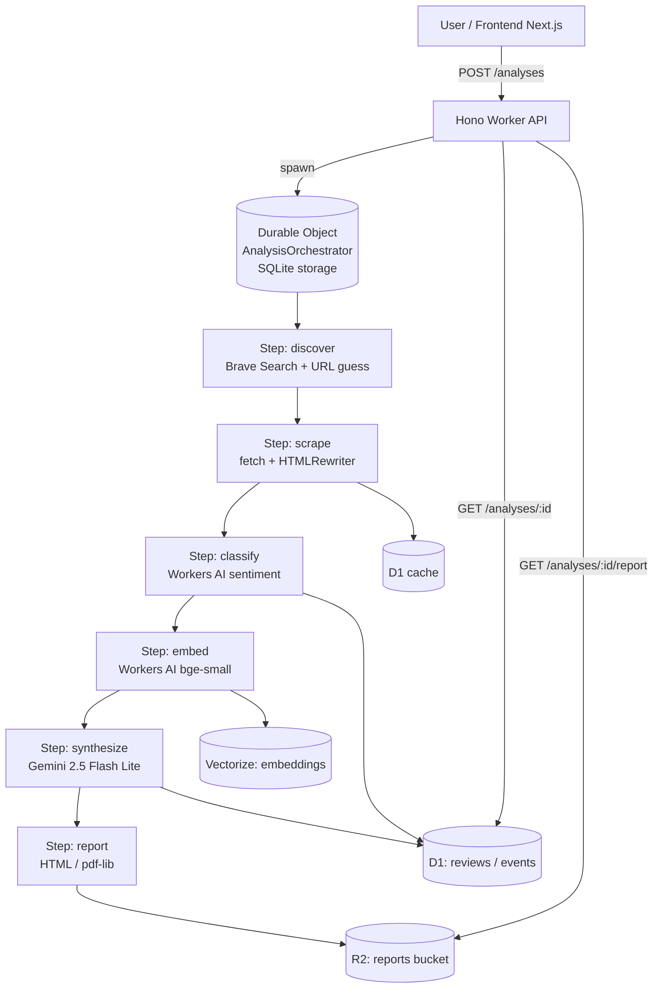

# VoC Intelligence Agent

Agentowy system AI, który analizuje publiczne opinie klientów (Trustpilot, Opineo, App Store
oraz import CSV/JSON) dla wybranej firmy i jej konkurentów. Orkiestrator agenta klasyfikuje
sentyment i tematykę, klasteruje tematy w przestrzeni embeddingów, a następnie syntetyzuje
raport biznesowy z wykresami i listą priorytetowych action itemów. Cały projekt mieści się
wyłącznie w darmowych tierach (Cloudflare Workers + D1 + Vectorize + Workers AI + R2 +
Pages, Gemini 2.5 Flash Lite, Brave Search) — bez płatnych usług.

## Architektura



## Limity darmowego tieru

| Usługa            | Limit                                | Uwagi                                              |
| ----------------- | ------------------------------------ | -------------------------------------------------- |
| Workers AI        | **10 000 neuronów / dzień**          | klasyfikacja sentymentu + embeddingi (bge-small)   |
| Gemini 2.5 Flash Lite | **1 500 RPD**                    | planning, reflection, synteza raportu              |
| Brave Search      | **2 000 zapytań / miesiąc**          | discovery linków do recenzji                       |
| Cloudflare D1     | **5 000 000 odczytów / dzień**       | persystencja analiz, recenzji, cache scrapingu     |
| Cloudflare Vectorize | **30 000 000 zapytanych wymiarów / mc** | wyszukiwanie podobieństw embeddingów               |
| Durable Objects (SQLite) | **free**                      | wymagane `new_sqlite_classes` w `wrangler.toml`    |
| Workers Requests  | **100 000 / dzień**                  | wszystkie endpointy API                            |
| Pages             | **500 buildów / mc, ruch unlimited** | hosting frontendu Next.js                          |
| R2                | **10 GB storage, 1M Class A op / mc**| eksport raportów HTML/PDF                          |

> **Dlaczego nie Cloudflare Workflows?** Workflows są płatne — używamy Durable Object z
> wbudowanym storage SQLite jako lekkiego orkiestratora kroków agenta.
>
> **Dlaczego nie Browser Rendering jako wymagany?** Free tier daje tylko 10 minut/dzień,
> co kończy się po kilku analizach. Domyślnie używamy `fetch` + `HTMLRewriter`; rendering
> przeglądarki będzie opcjonalnym fallbackiem.

## Setup

### 1. Konta i klucze

1. **Cloudflare** — załóż konto na <https://dash.cloudflare.com>, zainstaluj
   `npm i -g wrangler` i zaloguj się: `wrangler login`.
2. **Google AI Studio** — wygeneruj klucz Gemini: <https://aistudio.google.com/app/apikey>.
3. **Brave Search** — załóż konto i klucz API: <https://api.search.brave.com>
   (plan **Free** = 2000 zapytań/mc).

### 2. Lokalna instalacja

```bash
pnpm install
cp .env.example .env
cp apps/api/.dev.vars.example apps/api/.dev.vars
# uzupełnij GEMINI_API_KEY i BRAVE_SEARCH_API_KEY w apps/api/.dev.vars
```

### 3. Utwórz zasoby Cloudflare

```bash
# D1 - skopiuj wyświetlone database_id do apps/api/wrangler.toml
pnpm --filter @voc/api d1:create

# Vectorize (384 wymiary, cosine - pasuje do bge-small)
pnpm --filter @voc/api vectorize:create

# R2 bucket na raporty
pnpm --filter @voc/api r2:create
```

### 4. Migracja schematu D1

```bash
pnpm --filter @voc/api d1:migrate:local    # lokalnie (.wrangler/state)
pnpm --filter @voc/api d1:migrate:remote   # w produkcji
```

### 5. Dev

```bash
pnpm dev
# API:    http://localhost:8787   (sprawdź: GET /health -> {"ok":true})
# Web:    http://localhost:3000
```

### 6. Deploy

```bash
pnpm --filter @voc/api deploy        # wrangler deploy
pnpm --filter @voc/web deploy        # next-on-pages + wrangler pages deploy
```

## Struktura repo

```
.
├── apps/
│   ├── api/                # Cloudflare Worker + Hono + Durable Object
│   │   ├── migrations/     # D1 migrations (SQL)
│   │   └── src/
│   └── web/                # Next.js 15 (App Router) + Tailwind
├── packages/
│   └── shared/             # wspólne typy, stałe, prompty
├── .env.example
├── pnpm-workspace.yaml
└── tsconfig.base.json
```

## TODO — fazy

### P2 — Discovery & Scraping
- [ ] Implementacja kroku `discover` w Durable Object: Brave Search + heurystyka URL.
- [ ] Scraper Trustpilot/Opineo z `fetch` + `HTMLRewriter`, cache w D1 (TTL 24h).
- [ ] Parser App Store (RSS feed / web).
- [ ] Tryb `manual_paste` — walidacja CSV/JSON wklejonych recenzji.

### P3 — Klasyfikacja & embeddingi
- [ ] Wpięcie Workers AI: `@cf/huggingface/distilbert-sst-2-int8` (sentyment).
- [ ] Klasyfikacja kategorii (price/service/quality/...) — Gemini Flash Lite z few-shot.
- [ ] Embeddingi `@cf/baai/bge-small-en-v1.5` -> Vectorize.
- [ ] Klastrowanie tematów po embeddingach (k-NN, top themes).

### P4 — Synteza & raport
- [ ] Prompt syntezy w Gemini -> ścisły JSON (`AnalysisSummary`).
- [ ] Generator raportu HTML (Tailwind print) + opcjonalnie PDF (`pdf-lib`).
- [ ] Upload do R2, signed URL na frontend.
- [ ] Streaming progresu (SSE z DO -> Worker -> klient).

### P5 — Frontend & polish
- [ ] Formularz `BusinessInput` (auto / manual_paste).
- [ ] Live-progress agenta (eventy z `events` z D1).
- [ ] Wykresy Recharts: sentyment globalny, breakdown per kategoria, porównanie z konkurencją.
- [ ] Lista action itemów z impact/effort scatter plotem.
- [ ] Ochrona przed nadużyciami: rate limit per IP w Worker, telemetria neuronów Workers AI.

## Definition of done (P1)

- `pnpm install && pnpm dev` odpala API na `:8787` i web na `:3000`.
- `GET http://localhost:8787/health` zwraca `{"ok":true}`.
- `pnpm --filter @voc/api d1:migrate:local` przechodzi.
- `wrangler dev` pokazuje binding `ANALYSIS_DO` bez błędów (klasa SQLite).
